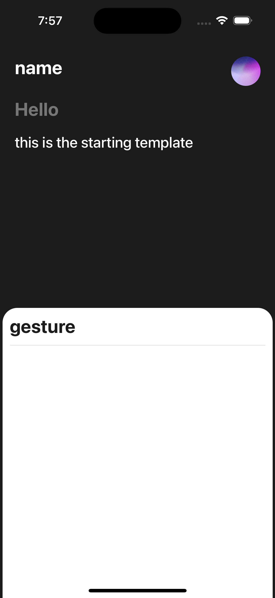
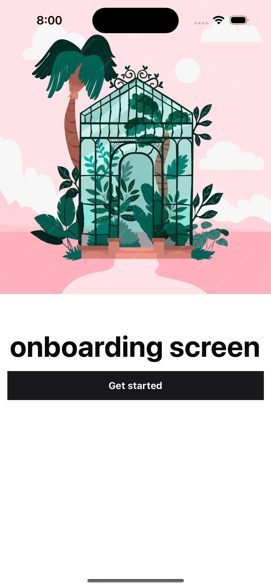
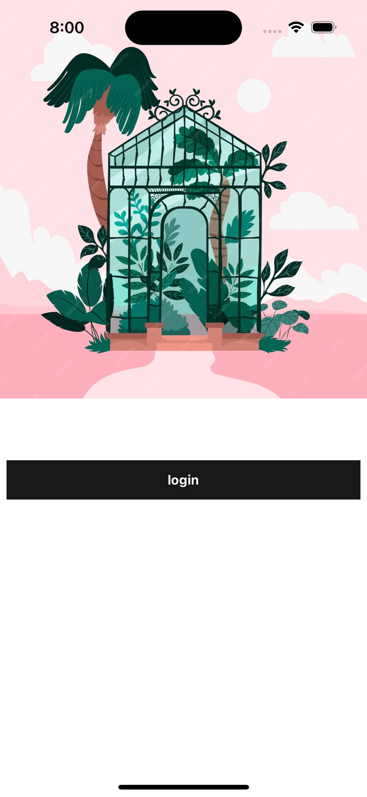

# Expo Onboard Template

This template is pre-installed with Expo Router, NativeWind v4, and reusable React components similar to shadcn.
## Template Images

Here are some images of the templates:

<div style="display: flex; justify-content: space-around;">
   
   
   
</div>
## Getting Started

To get started, clone the repository:

```bash
git clone https://github.com/mellofordev/expo-onboard-template.git
```

Navigate into the project directory:

```bash
cd expo-onboard-template
```

Install the dependencies:

```bash
npm install
```

## Running the App

To run the app, use the following command:

```bash
npx expo start
```

## Features

- **Expo Router**: Simplified navigation for your app.
- **NativeWind v4**: Utility-first CSS framework for React Native.
- **Reusable Components**: Pre-built components for faster development.

## Screens

- **Onboard Screen**: Includes basic styling to get you started.

Enjoy building your app with this template!